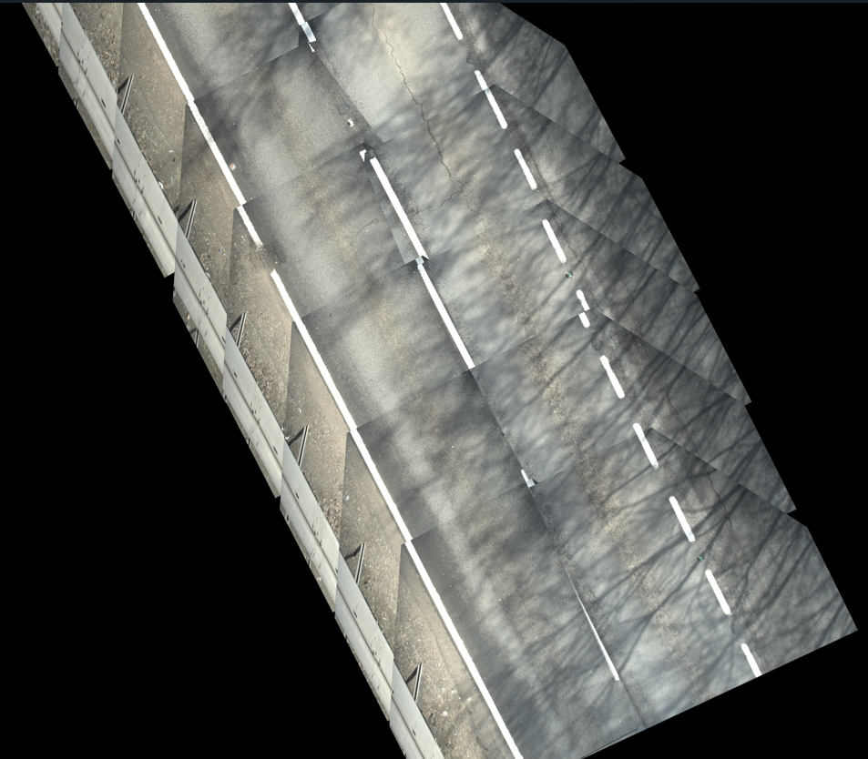
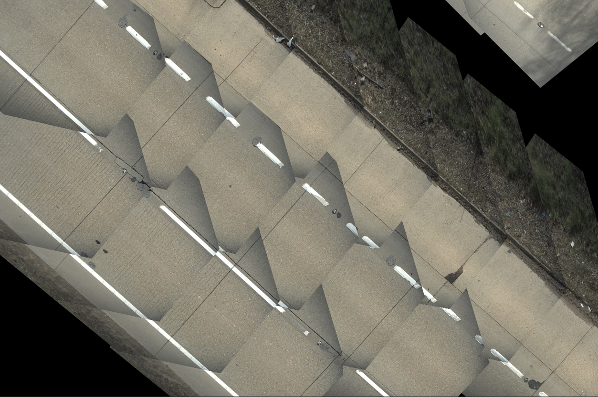
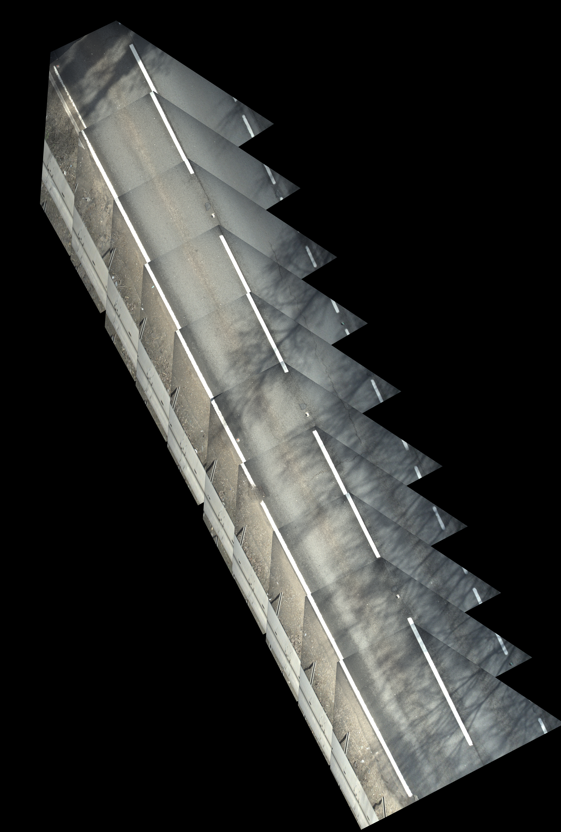

# Orthomosaics
Converting backdown images and pointclouds for road surface defect detection






## Rest API

Run the app locally by running: `python app.py`

You can check the app is running by visiting the following endpoint in your browser (`http://localhost:8000/docs/`) which will give a detailed breakdown of the available endpoints and their expected inputs.

There are two main endpoints. 

### 1. Add to an orthmosaic image
To build up an orthomosaic, you will require the backdown images and somea additional details about where and how these images were taken (e.g. gps coordinates, their roll and pitch, etc) in order for the orthorectification and tiling to be performed properly.  Lets suppose we have a csv file with all relevant details called `samples.csv`

```csv
image_path,roll[deg],pitch[deg],heading[deg],projectedX[m],projectedY[m]
images/1.jpg,-47.34954,27.09975,572731.967,273978.545
images/2.jpg,-47.27221,27.15481,572730.591,273975.798
...
```

We can then loop through these images and add them to the orthomosaic image by calling the api. 

```python
from pandas import read_csv

backdown_images = read_csv("../data/reference.csv")
```

The payload for each POST call is constructed like so (you can also check this structure from `/docs/`):

```python
from requests import post
from orthomosaics.utils.rest_api import encode_image

orthomosaic_metadata = None
for index in range(len(backdown_images)):

    print(index, orthomosaic_metadata)

    response = post(
        url="http://localhost:8000/orthomosaic/", 
        json=dict(
            backdown_image_b64=encode_image(
                image_path=backdown_images.loc[index]['image_path']
            ),
            gps=dict(
                x=backdown_images.loc[index]["projectedX[m]"],
                y=backdown_images.loc[index]["projectedY[m]"],
                heading=backdown_images.loc[index]["heading[deg]"],
            ),
            backdown_image_metadata=dict(
                roll_deg=backdown_images.loc[index]["roll[deg]"],
                pitch_deg=backdown_images.loc[index]["pitch[deg]"],
            ),
            orthomosaic_metadata=orthomosaic_metadata,
        )
    )

    if response.ok:
        results = response.json()
        print(results["message"])
        orthomosaic_metadata = results["orthomosaic_metadata"]
    else:
        print(response.reason)
        print(response.json())
```
- Note: We convert each backdown image into a base64 string when adding it to the payload (using the helper function `encode_image`)
- Note: For a new orthomosaic image, the `orthomosaic_metadata` value for the initial POST request will be `None` but subsequent calls will have values based on what is returned from the previous POST request (this ensures the backdown images are all being added to the correct orthomosaic image). It will look something like this:

```python
>>>print(orthomosaic_metadata)

OrthomosaicMetadata(
    id=-6601842991516517283,
    x_m=572727.835,
    y_m=273970.318,
    x_m_per_pixel=0.0016551310522701223,
    y_m_per_pixel=0.0016551310522701223,
)
```

After that, the constructed orthomosaic will be saved in Azure Storage. 


### 2. Download an Orthmosaic

You can view and download the orthomosaic image via the Azure Storage Blob directly.  However, you can also download it via the following endpoint if desired:

```python
from requests import get

id = ************* #THE ID OF YOUR ORTHOMOSAIC (Find this in the corresponding OrthomosaicMetadata.id)
response = get(url=f"http://localhost:8000/orthomosaic/?orthomosaic_id={id}")
if response.ok:
    with open(f"orthomosaic_{id}.png",'wb') as file:
        file.write(response.content)
else:
    print(response.json())
```
The RGBA image will be saved locally as a png file


